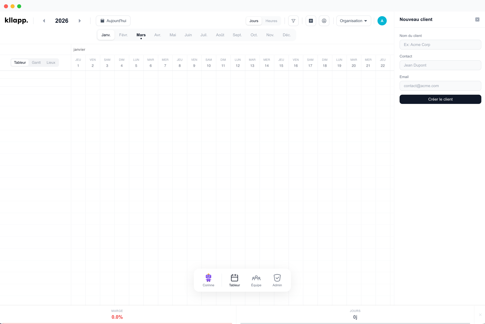

<p align="center">
  <br/>
  <sub><strong>Desktop</strong></sub>
</p>

<p align="center">
  Standalone desktop app — works offline or connected to kllapp.com.
</p>

<p align="center">
  
  
  
  
</p>

<p align="center">
  
</p>

---

## What is this?

KLLAPP Desktop wraps [KLLAPP](https://github.com/oxynum/kllapp) in an Electron shell with two modes:

- **Offline mode** — Embedded PGlite database (PostgreSQL WASM). No server, no Docker, no cloud account. All data stays on your machine.
- **Online mode** — Opens kllapp.com directly in the desktop app. Sign in with Google or magic link, access your organization and data as usual.

On first launch, a setup screen lets you choose your mode. You can switch anytime:
- In **offline mode** → click "Go online" in the top-right corner
- In **online mode** → click "Go offline" in the top-right corner

| | Web version | Desktop (offline) | Desktop (online) |
|---|---|---|---|
| Database | PostgreSQL server | PGlite (embedded) | kllapp.com |
| Auth | Google OAuth + Magic Link | Auto-login | Google OAuth + Magic Link |
| Real-time | Liveblocks collaboration | Single user | Liveblocks collaboration |
| AI assistant | Anthropic API | Optional (bring your key) | Included |

## Quick Start

### Prerequisites

- **Node.js** >= 20
- **Git**

### Setup

```bash
# 1. Clone this repo
git clone https://github.com/oxynum/kllapp-desktop.git
cd kllapp-desktop

# 2. Install dependencies
npm install

# 3. Run setup (clones kllapp, applies patches)
npm run setup

# 4. Initialize local database (offline mode)
node scripts/init-db.mjs

# 5. Start in dev mode
npm run dev
```

### Build for distribution

```bash
# Build native installer for your platform
npm run build:desktop

# Output in release/
# - macOS: KLLAPP-1.0.0.dmg
# - Windows: KLLAPP-Setup-1.0.0.exe
# - Linux: KLLAPP-1.0.0.AppImage
```

## Architecture

```
kllapp-desktop/
├── electron/               # Electron main process
│   ├── main.ts             # Window, mode detection, CSS injection
│   ├── next-server.ts      # Start Next.js standalone server
│   ├── database.ts         # PGlite init + migrations
│   └── preload.ts          # IPC bridge to renderer
├── patches/                # Files that replace kllapp source files
│   ├── db-adapter.ts       # PGlite database adapter
│   ├── auth-bypass.ts      # Single-user auto-login
│   ├── desktop-config.ts   # Config read/write (config.json)
│   ├── desktop-setup-*.tsx # Setup page (mode selection)
│   ├── desktop-redirect-*  # Redirect page for online mode
│   ├── go-online-button.tsx # "Go online" button component
│   ├── dashboard-layout-*  # Dashboard with safe zone
│   ├── liveblocks-mock.ts  # No-op Liveblocks hooks
│   ├── providers-patch.tsx # Providers without Liveblocks
│   ├── s3-local.ts         # Local file storage
│   └── middleware-patch.ts # Middleware with setup redirect
├── scripts/
│   ├── setup.sh            # Clone kllapp + apply patches
│   ├── init-db.mjs         # Initialize PGlite + seed user
│   └── build-desktop.sh    # Build Next.js + Electron
└── kllapp/                 # (cloned by setup, gitignored)
```

### How it works

**Offline mode:**
- Next.js runs locally inside Electron with PGlite (PostgreSQL WASM)
- Data stored in `~/Library/Application Support/KLLAPP/pgdata/`
- No internet connection needed

**Online mode:**
- Electron loads kllapp.com directly (like a dedicated browser)
- Injected CSS creates a safe titlebar area for macOS traffic lights
- "Go offline" button injected in the top-right corner
- Full authentication via Google OAuth or magic link

### How patches work

The `setup.sh` script:
1. Clones `oxynum/kllapp` into `kllapp/`
2. Copies patch files over specific source files
3. Replaces Liveblocks imports with mock module
4. Patches the dashboard page for SSR-safe grid rendering
5. Generates Drizzle migrations for PGlite

Re-run `npm run setup` to pull the latest features from the web version.

## Data storage (offline mode)

| OS | Location |
|---|---|
| macOS | `~/Library/Application Support/KLLAPP/` |
| Windows | `%APPDATA%/KLLAPP/` |
| Linux | `~/.config/KLLAPP/` |

- `config.json` — Mode selection (local/remote)
- `pgdata/` — PGlite database files
- `files/` — Uploaded files (expenses, receipts)

## AI Assistant (offline mode)

The AI assistant (Corinne) works in offline mode if you provide an Anthropic API key:

1. Edit `kllapp/.env.local`
2. Add: `ANTHROPIC_API_KEY=sk-ant-...`
3. Restart the app

In online mode, the AI assistant uses the server-side key from kllapp.com.

## License

Same as [KLLAPP](https://github.com/oxynum/kllapp/blob/main/LICENSE) — Sustainable Use License.

---

<p align="center">
  Built by <a href="https://oxynum.fr">Oxynum</a>
</p>
